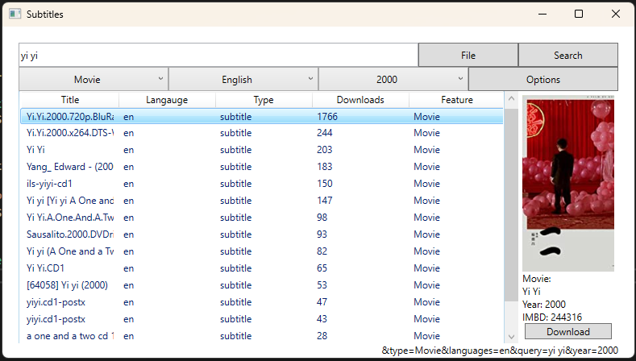

subtitle downloader. Work in progress.



A file path can be specified to the executable:

```
  .\subsl.exe '{\"filepath\": \"X:\movies\Yi Yi (2000) [1080p]\Yi.Yi.2000.1080p.mp4\"}", \"filename\": \"Yi Yi 2000\"}'
```

This will calcuate the moviehash and automatically search for matches. It will also populate the text passed in filename into the search box for use if the moviehash fails. 
